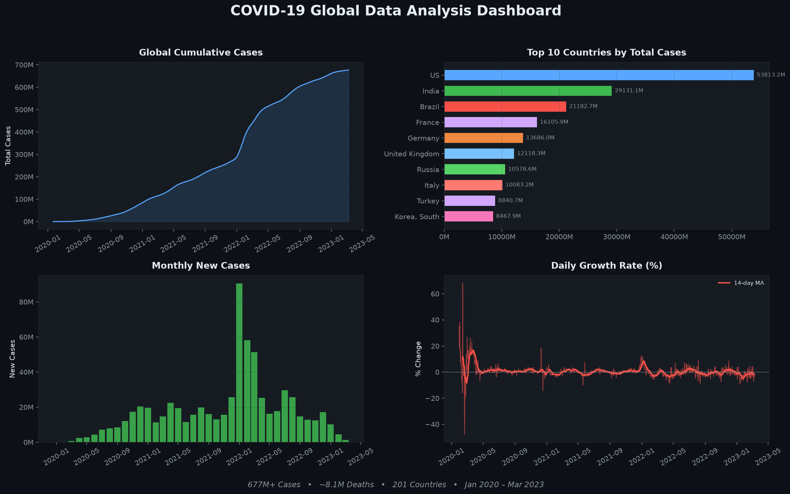

<h1 align="center">🦠 COVID-19 Data Analysis</h1>

<p align="center">
  
  
  
  
</p>

<p align="center">
  End-to-end analysis of global COVID-19 data — from raw JHU time series to interactive visualizations and statistical insights.
</p>

---

## 📊 Dashboard

<p align="center">
  
</p>

The dashboard above visualizes key trends from **677M+ confirmed cases** across **201 countries** (Jan 2020 – Mar 2023):

| Panel | Insight |
|-------|---------|
| **Global Cumulative Cases** | Steady growth from Jan 2020 to Mar 2023, with acceleration during Delta & Omicron waves |
| **Top 10 Countries** | US leads with ~103M cases, followed by India, France, Germany, and Brazil |
| **Monthly New Cases** | Massive Omicron spike in Jan 2022 (~170M cases in a single month) |
| **Daily Growth Rate** | Volatile early pandemic, stabilizing over time as vaccination campaigns scaled |

---

## 🗂 Project Structure

```
covid-19-analysis/
├── data/
│   └── raw_covid_data.csv          # JHU COVID-19 time series dataset
├── src/
│   ├── data_loader.py              # Fetches & loads data from JHU, WHO, OWID
│   ├── analyzer.py                 # Statistical analysis engine
│   ├── visualizer.py               # Chart generation (line, bar, growth rate)
│   └── main.py                     # Pipeline orchestrator
├── output/
│   ├── dashboard.png               # README showcase dashboard
│   ├── plots/
│   │   ├── time_series.png         # Global cumulative trend
│   │   └── growth_rate.png         # Daily growth rate chart
│   └── analysis_report.txt         # Auto-generated summary report
├── tests/                          # Unit tests
├── requirements.txt                # Python dependencies
└── README.md
```

---

## ⚡ Quick Start

```bash
# Clone
git clone https://github.com/dawson-efraim/covid-19-analysis.git
cd covid-19-analysis

# Install
pip install -r requirements.txt

# Run analysis
python src/main.py
```

Output is saved to `output/` — plots in `output/plots/`, report in `output/analysis_report.txt`.

---

## 🔧 Features

- **Multi-source data loading** — Pulls from Johns Hopkins, WHO, and Our World in Data with automatic fallback
- **OOP architecture** — Clean separation of concerns: loader → analyzer → visualizer
- **Automated visualizations** — Time series, country rankings, monthly trends, growth rates
- **Analysis reports** — Auto-generated summary statistics exported to text
- **Unit tested** — Test suite in `tests/` for core components

---

## 📈 Data Sources

| Source | Description |
|--------|-------------|
| [Johns Hopkins CSSE](https://github.com/CSSEGISandData/COVID-19) | Primary dataset — global confirmed cases time series |
| [WHO](https://covid19.who.int/) | Backup — global table data |
| [Our World in Data](https://ourworldindata.org/covid-deaths) | Backup — comprehensive OWID dataset |

---

## 🛠 Tech Stack

- **Python 3.10+**
- **Pandas** — Data manipulation & time series handling
- **Matplotlib / Seaborn** — Visualization
- **Requests** — API data fetching
- **Pytest** — Unit testing

---

<p align="center">
  <i>Built as part of a data science learning journey.</i><br>
  <sub>Raw JHU data → Clean analysis → Polished insights</sub>
</p>
